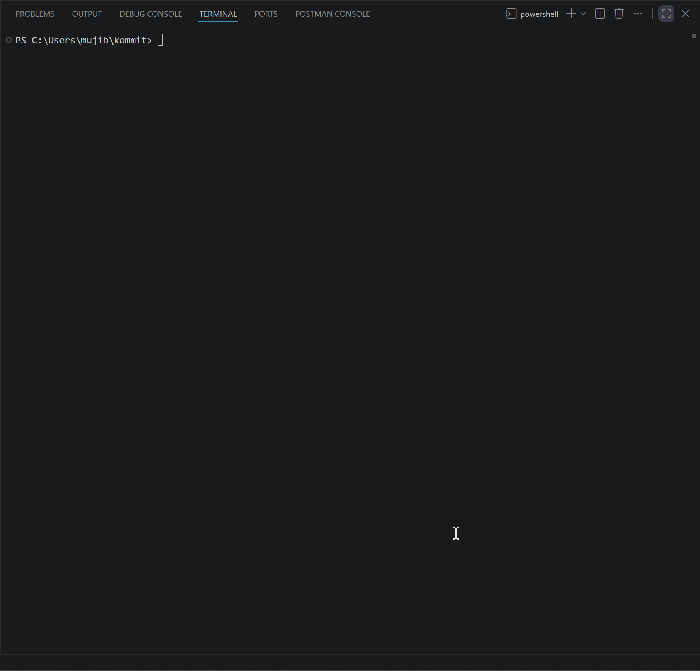

# kommit

AI-powered git commit messages in your terminal.
Supports OpenAI, Anthropic, Gemini and Ollama.

> v0.1.0 — tested on Windows with Gemini. 
> Mac/Linux support coming in v0.2.0.

---

## Demo




---

## How it works

Run `kommit` in any git repo with staged changes.
It reads your diff, sends it to an AI provider,
and shows you 3 commit message options to pick from.

◆ KOMMIT — analyzing your changes...
staged: 3 files  +47  -12
generating commit messages...

feat(ai): add gemini and ollama providers
feat: support multiple LLM providers
chore: add gemini, ollama, openai, anthropic support

[1/2/3] pick  [↑↓] navigate  [enter] select  [e] edit  [q] quit

---

## Install

```bash
go install github.com/mujib77/kommit@latest
```

---

## Setup

Create a config file at `~/.kommit/config.yaml`:

```yaml
provider: gemini        # gemini | openai | anthropic | ollama
api_key: your-key-here
model: gemini-3.5-flash
style: conventional     # conventional | simple
language: english
```

**Getting API keys:**

Gemini (free)    → aistudio.google.com → Get API Key
OpenAI           → platform.openai.com → API Keys
Anthropic        → console.anthropic.com → API Keys
Ollama (free)    → ollama.com/download → no key needed

**Ollama setup:**

```bash
ollama pull llama3.2
ollama serve
```

Then set provider to `ollama` in config — no API key needed.

---

## Usage

```bash
# stage your changes
git add .

# run kommit
kommit

# pick a message, edit if needed, press enter
# done — your commit is made
```

---

## Providers

| Provider  | Free | Tested | Model |
|-----------|------|--------|-------|
| Gemini    | ✅   | ✅     | gemini-3.5-flash |
| Ollama    | ✅   | coming soon | llama3.2 |
| OpenAI    | ❌   | coming soon | gpt-4o |
| Anthropic | ❌   | coming soon | claude-sonnet |

---

## Roadmap

v0.1.0  ✅  3 message options, 4 providers, interactive TUI
v0.2.0  →   atomic commit splitter
detects unrelated changes, splits into logical commits
v0.3.0  →   repo style learner
scans your commit history, matches your team style
v0.4.0  →   Mac/Linux support, brew install

---

## Built With

- Go
- Cobra — CLI framework
- Bubbletea — TUI
- Lipgloss — terminal styling

---

## License

MIT